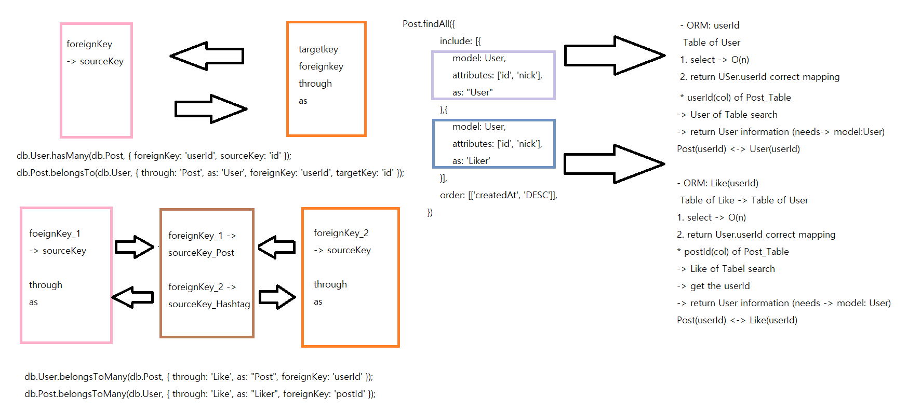

# sequelize 

## 1 대 1 관계
**주가 되는 1이 먼저 나와야 한다.**
```javascript
    db.User.hasOne(db.Post);
    db.Post.belongsTo(db.User);
```

## 1 대 다 관계
**1: (사용자 한명이 게시글을 많이 가지고 있다)**

**다: (게시글은 사용자에 속해 있다)**

**`foreignKey는 자동으로 생성 된다.`**
- 하지만 명시해주는것이 좋은 방법이라고 생각한다. 💁‍♂

Post테이블에 userId 자동 생성 (foreignKey)

**`through`** : table 참조 

**`as`** : 별칭 설정 (alias) (default:  name of Table what sourceKey)
- sequelize에서 사용되는 `include에서` 사용되는 as와 `foreignKey`(ex. Post.getUser({})) 참조 구문에서 사용된다. 

**`foreignKey`** : 외래키 이름 설정

**`sourceKey`** : 외래키 원천 key (default : primaryKey -> ex). id )

**`targetKey`** : sourceKey 에서 사용되는 key (default : sourceKey -> (primaryKey))

```javascript
    db.User.hasMany(db.Post, { foreignKey: 'userId', sourceKey: 'id' }); // foreignKey: Post.userId, sourceKey: User.id
    db.Post.belongsTo(db.User, { through: 'Post', as: 'User', foreignKey: 'userId', targetKey: 'id' }); // foreignKey: User.userId, sourceKey: Post.id
```

## 다 대 다 관계
**다대다 관계는 belongsToMany!!(belongsTo가 아니다.)**

**through에는 새로 생기는 모델 이름을 넣어준다.(매칭 테이블 생성)**
```javascript
    A.belongsToMany(B, {
        through: 'newTable', 
        as: '(alias)', 
        foreignKey:'A_id(DB of alias)', 
        sourceKey: 'A_id(default -> primarykey)'
    } )
```

```javascript
    // PostHashtag테이블 생성
    db.Post.belongsToMany(db.Hashtag, { through: 'PostHashtag', as: 'PostHashtag_Hashtag', foreignKey: 'postId' });
    db.Hashtag.belongsToMany(db.Post, { through: 'PostHashtag', as: 'PostHashtag_Post', foreignKey: 'hashtagId' });
```

```javascript
    db.User.belongsToMany(db.User, { through: 'Follow', as: 'Follow_Followers', foreignKey: 'followingId' });
    db.User.belongsToMany(db.User, { through: 'Follow', as: 'Follow_Followings', foreignKey: 'followerId' });
```

```javascript
    db.User.belongsToMany(db.Post, { through: 'Like', as: "Like_Post", foreignKey: 'userId' });
    db.Post.belongsToMany(db.User, { through: 'Like', as: "Like_Liker", foreignKey: 'postId' });
```

### What is point(mapping) which the foreignKey ....? 🤔🤔🤔
belongsTo냐 belongsToMany냐에 따라 foreignKey 방법이 달라 진다.

**참조하는 key가 무엇인지 판단한다.**

belongsTo인 경우에는 **`첫번째 인자의 table과 foreignKey모두 상대 테이블을`** 가리키면 된다. (참조 되어 있는 key)

ex).
```javascript
    db.User.hasMany(db.Post, { foreignKey: 'userId', sourceKey: 'id' });
    db.Post.belongsTo(db.User, { through: 'Post', as: 'User', foreignKey: 'userId', targetKey: 'id' });
```

belongstoMany의 경우에는 **`첫번째 인자의 table과 foreignKey를 반대되게`** 설정하면 된다. **(참조 되어있는 key의 상대 foreignKey의 값을 반환)**

ex).
```javascript
    // PostHashtag테이블 생성
    db.Post.belongsToMany(db.Hashtag, { through: 'PostHashtag', as: 'Hashtag', foreignKey: 'postId' });
    db.Hashtag.belongsToMany(db.Post, { through: 'PostHashtag', as: 'Post', foreignKey: 'hashtagId' });
```


## Sequelize Query

### findOne (select)
```javascript
    User.findOne({ where: { id: req.user.id } });
```

### findAll & include (select)
**includes에서 같은 모델이 여러 개면 as로 구분한다.**

- as명칭은 posts객체에 자동으로 key값으로 들어간다. 
```javascript
    router.get('/', (req, res, next) => {
        Post.findAll({
            include: [{
                model: User,
                attributes: ['id', 'nick'],
                as: "User"
            },{
                model: User,
                attributes: ['id', 'nick'],
                as: 'Like_Liker'
            }],
            order: [['createdAt', 'DESC']],
        })
            .then((posts) => {
                res.render('main', {
                    title: 'GoFlight',
                    twits: posts,
                    user: req.user,
                    loginError: req.flash('loginError'),
                });
            })
            .catch((error) => {
                console.error(error);
                next(error);
            });
    });
```

### update (update)
```javascript
    User.update({ nick: req.body.nick }, {
        where: { id: req.user.id },
    });
```

### create (insert)
```javascript
    Post.create({
        content: req.body.content,
        img: req.body.url,
        userId: req.user.id,
    });
```

### findOrCreate (insert)
```javascript
   if (hashtags) {
        const new_Create_Hashtags_Arr = await Promise.all(hashtags.map(tag => Hashtag.findOrCreate({
            where: { title: tag.slice(1).toLowerCase() },
        })));
        await post.addPostHashtag_Hashtag(new_Create_Hashtags_Arr.map(find_HashtagId => find_HashtagId[0])); 
    }
```

### destroy (delete)
```javascript
    await Post.destroy({
        where: {
            id: req.params.id,
            userId: req.user.id,
        },
    });
```

## foreignKey

    A.getB: 관계있는 로우 조회
    A.addB: 관계 생성
    A.setB: 관계 수정
    A.removeB: 관계 제거

### get

```javascript
    // PostHashtag테이블 생성
    db.Post.belongsToMany(db.Hashtag, { through: 'PostHashtag', as: 'PostHashtag_Hashtag', foreignKey: 'postId' });
    db.Hashtag.belongsToMany(db.Post, { through: 'PostHashtag', as: 'PostHashtag_Post', foreignKey: 'hashtagId' });
```

```javascript
    hashtag.getPostHashtag_Post({ include: [{ model: User, as: "User" }] });
```

### add
`followingId`: req.params.id (상대방 id)

`followerId`: req.user.id (자신 id)

followerId -> followingId (내가 팔로워 하는 유저들)
followerId <- followingId (나를 팔로잉 하는 유저들)

```javascript
    db.User.belongsToMany(db.User, { through: 'Follow', as: 'Follow_Followers', foreignKey: 'followingId' });
    db.User.belongsToMany(db.User, { through: 'Follow', as: 'Follow_Followings', foreignKey: 'followerId' });
```

```javascript
    router.post('/:id/follow', isLoggedIn, async (req, res, next) => {
        try {
            const user = await User.findOne({ where: { id: req.user.id } });
            await user.addFollow_Followings(parseInt(req.params.id, 10));
            res.status(200).send('Follow_OK');
        } catch (error) {
            console.error(error);
            next(error);
        }
    });
```

### remove 
`followingId`: req.params.id (상대방 id)

`followerId`: req.user.id (자신 id)

followerId -> followingId (내가 팔로워 하는 유저들)
followerId <- followingId (나를 팔로잉 하는 유저들)

```javascript
    db.User.belongsToMany(db.User, { through: 'Follow', as: 'Follow_Followers', foreignKey: 'followingId' });
    db.User.belongsToMany(db.User, { through: 'Follow', as: 'Follow_Followings', foreignKey: 'followerId' });
```

```javascript
    router.post('/:id/unfollow', isLoggedIn, async (req, res, next) => {
        try {
            const user = await User.findOne({ where: { id: req.user.id } });
            await user.removeFollow_Followers(parseInt(req.params.id, 10));
            res.status(200).send('UnFollow_OK');
        } catch (error) {
            console.error(error);
            next(error);
        }
    });
```
